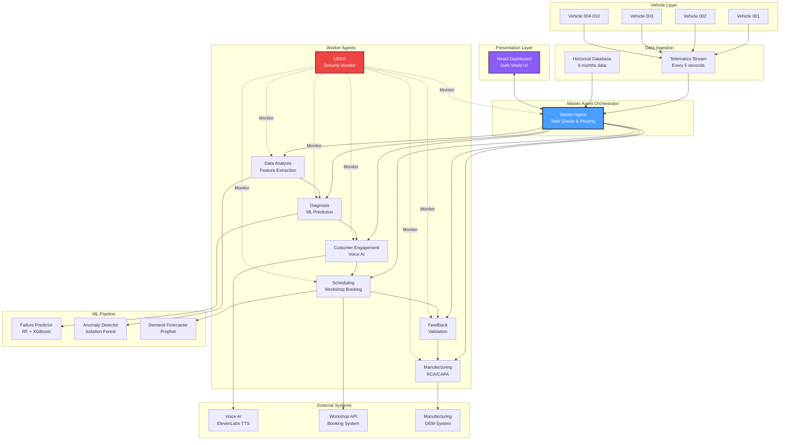
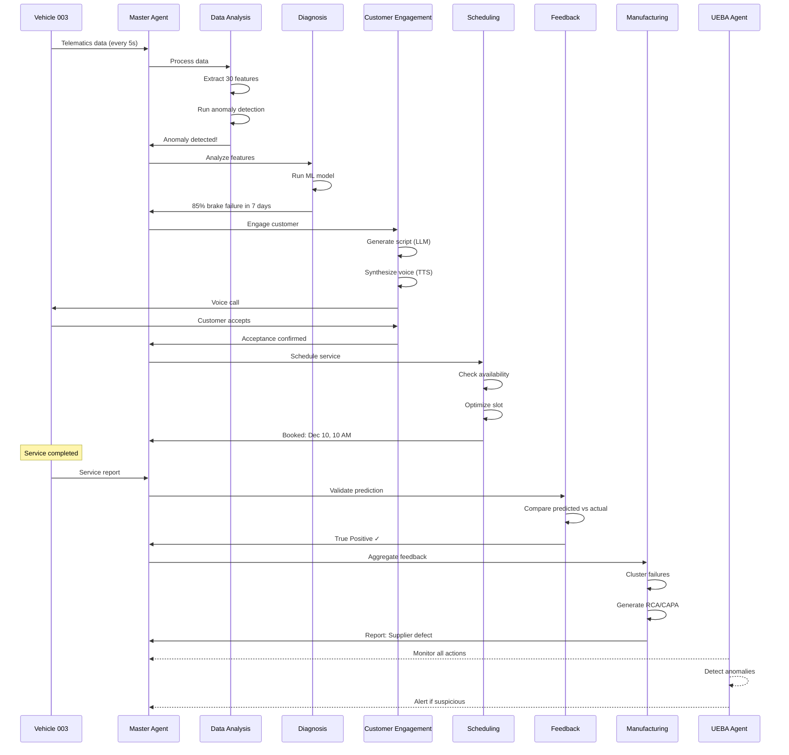
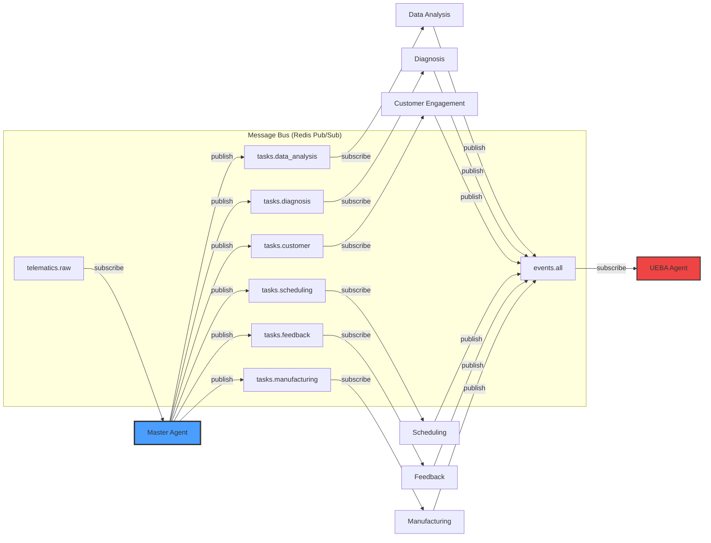
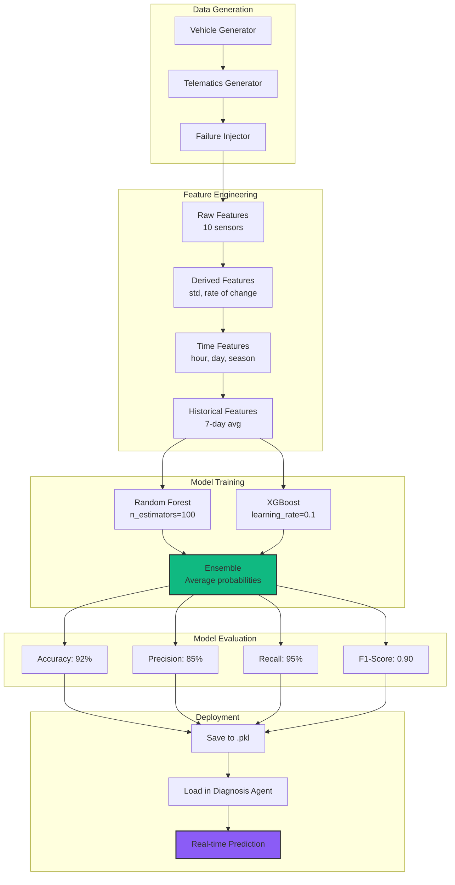
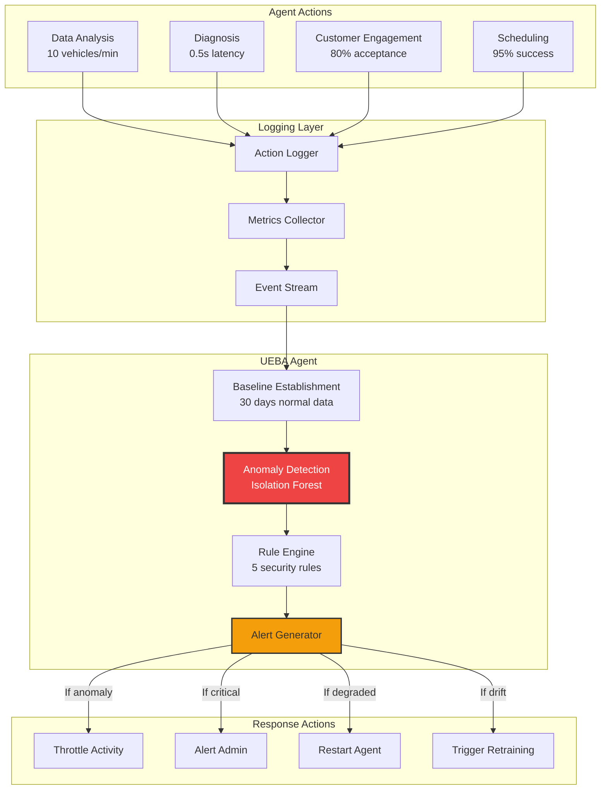
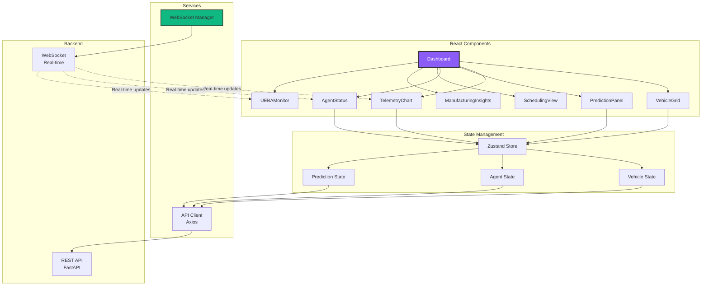
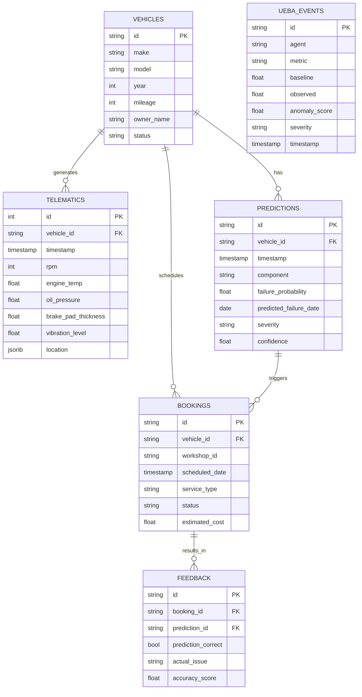
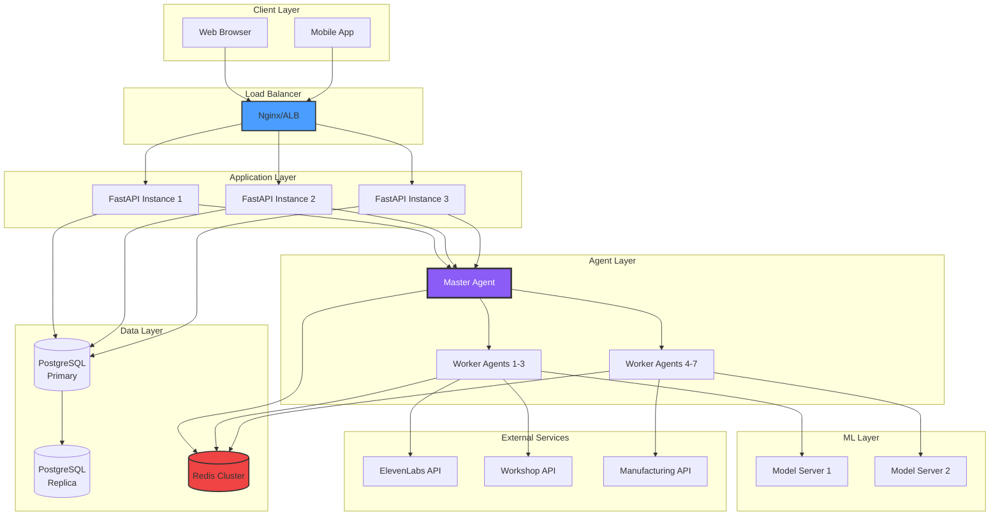
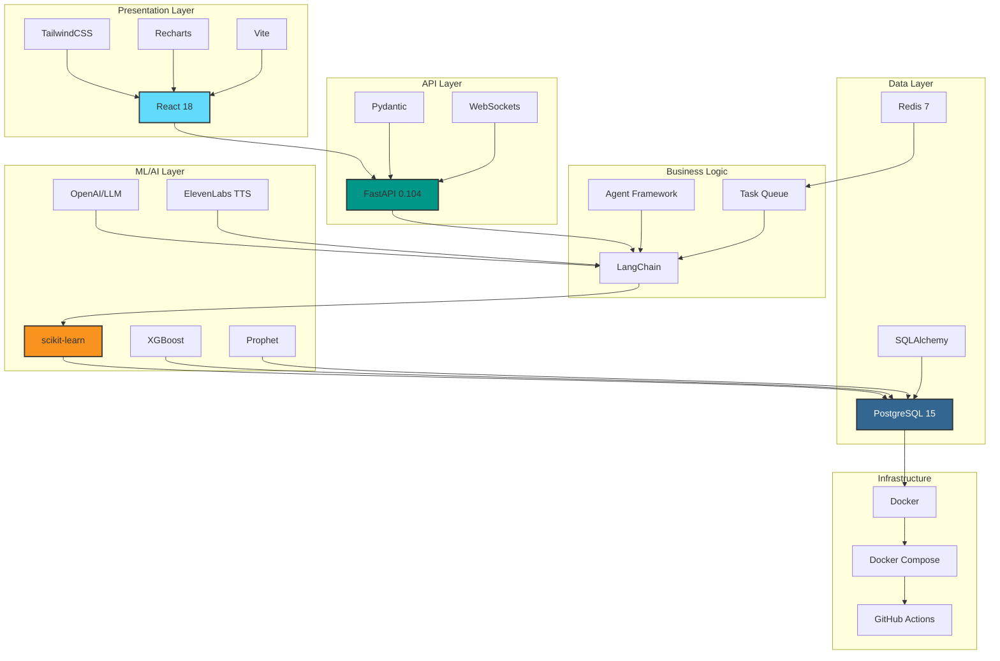

# 🏗️ AuroraSync OS - Architecture Diagrams

This document contains visual diagrams for presentations and documentation.

---

## 1. High-Level System Architecture

---

## 2. Data Flow Sequence

---

## 3. Agent Communication Architecture

---

## 4. ML Pipeline Architecture

---

## 5. UEBA Security Architecture

---

## 6. Frontend Architecture

---

## 7. Database Schema

---

## 8. Deployment Architecture

---

## 9. Technology Stack Diagram

---

## 10. Demo Flow Diagram

```mermaid
graph LR
    START([Start Demo]) --> S1[Show Dashboard<br/>10 vehicles]
    S1 --> S2[Click VEH003<br/>Critical status]
    S2 --> S3[Show Telemetry<br/>Vibration spike]
    S3 --> S4[Show Prediction<br/>85% brake failure]
    S4 --> S5[Agent Status<br/>8 agents working]
    S5 --> S6[Play Voice Call<br/>Customer accepts]
    S6 --> S7[Show Booking<br/>Dec 10, 10 AM]
    S7 --> S8[Complete Service<br/>Brake pads replaced]
    S8 --> S9[Show RCA/CAPA<br/>Supplier defect]
    S9 --> S10[UEBA Demo<br/>Simulate attack]
    S10 --> S11[Show Mitigation<br/>Auto-throttle]
    S11 --> END([End: Impact<br/>95% reduction])
    
    style START fill:#10b981,stroke:#333,stroke-width:2px,color:#fff
    style S6 fill:#8b5cf6,stroke:#333,stroke-width:2px,color:#fff
    style S10 fill:#ef4444,stroke:#333,stroke-width:2px,color:#fff
    style END fill:#10b981,stroke:#333,stroke-width:2px,color:#fff
```

---

## Usage Instructions

### For Presentations
1. Copy any diagram to your presentation tool
2. Most tools support Mermaid (PowerPoint, Google Slides with plugins)
3. Or render to PNG using: https://mermaid.live/

### For Documentation
1. These diagrams are already in Markdown
2. GitHub, GitLab, and most doc tools render Mermaid automatically
3. Use in README, wiki, or technical docs

### For Judges
1. Print Diagram 1 (High-Level Architecture) as poster
2. Use Diagram 2 (Data Flow) during demo
3. Show Diagram 10 (Demo Flow) at start of presentation

---

## Customization

To modify diagrams:
1. Visit https://mermaid.live/
2. Paste diagram code
3. Edit and preview in real-time
4. Export as PNG/SVG

---

**These diagrams are designed to impress judges and clearly communicate your technical architecture. Use them liberally in your presentation! 🎨**
